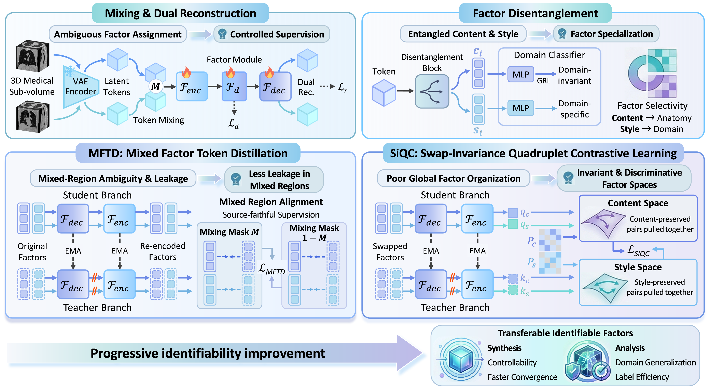

# MeDUET
<a href="https://arxiv.org/abs/2602.17901"></a>

**MeDUET** is a unified pretraining framework for **3D medical image synthesis and analysis** in the **VAE latent space**.

Our core idea is to treat unified pretraining under multi-center style shifts as a **factor identifiability** problem. MeDUET learns to disentangle each 3D medical volume into

- 🧬 **content**, which captures domain-invariant anatomy
- 🎨 **style**, which captures acquisition-related appearance

By learning identifiable and transferable content and style factors, MeDUET provides a shared foundation for both controllable generation and robust medical image analysis.

---
## 📝 TODO
- [x] 📄 Paper released
- [x] 🧠 Pretraining code
- [ ] 📦 Pretrained model weights
- [ ] 🔧 Downstream code

---
## 🔎 Overview

In real-world medical imaging, data from different centers often share similar anatomy while exhibiting large appearance variations caused by scanners, protocols, and acquisition conditions. This makes it difficult to directly unify generative modeling and representation learning.

MeDUET addresses this challenge through a disentangled pretraining framework built in the latent space of a pretrained VAE. The framework is designed to support both downstream synthesis and downstream analysis in a unified way.

<p align="center">
  
</p>

---
## 💡 Key Ideas

MeDUET is built on three main components

<table>
  <thead>
    <tr>
      <th align="left" width="36%">Component</th>
      <th align="left">Description</th>
    </tr>
  </thead>
  <tbody>
    <tr>
      <td>🧩 <b>Demixing for Factor Supervision</b></td>
      <td>Token demixing constructs controlled mixtures in latent space and provides explicit supervision for factor separation.</td>
    </tr>
    <tr>
      <td>🎯 <b>MFTD</b></td>
      <td>Mixed Factor Token Distillation encourages source-faithful factor assignment and reduces factor leakage in mixed regions.</td>
    </tr>
    <tr>
      <td>🔄 <b>SiQC</b></td>
      <td>Swap-invariance Quadruplet Contrast structures the content and style spaces to improve invariance and discriminability.</td>
    </tr>
  </tbody>
</table>

<p>
Together, these components help MeDUET learn more identifiable content and style representations that can be transferred to both synthesis and analysis tasks.
</p>

---
## ✨ Features

MeDUET aims to bridge two lines of research that are usually developed separately

- **medical image synthesis**
- **medical image analysis**

<table>
  <thead>
    <tr>
      <th align="left" width="34%">Feature</th>
      <th align="left">Description</th>
    </tr>
  </thead>
  <tbody>
    <tr>
      <td>🧬 <b>Unified Synthesis and Analysis</b></td>
      <td>Bridges <b>3D medical image synthesis</b> and <b>medical image analysis</b> within a shared pretraining framework.</td>
    </tr>
    <tr>
      <td>🎛️ <b>Disentangled Factor Learning</b></td>
      <td>Decomposes each 3D medical volume into <b>content</b> and <b>style</b> factors in the VAE latent space.</td>
    </tr>
    <tr>
      <td>🎨 <b>Controllable Generation</b></td>
      <td>Enables controllable medical image synthesis by independently conditioning generation on disentangled <b>content</b> and <b>style</b> factors.</td>
    </tr>
    <tr>
      <td>⚡ <b>Faster Diffusion Convergence</b></td>
      <td>Transfers pretrained representations to diffusion transformers for faster optimization and improved synthesis quality.</td>
    </tr>
    <tr>
      <td>🌍 <b>Strong Domain Generalization</b></td>
      <td>Learns domain-invariant anatomical representations that are more robust to multi-center style shifts.</td>
    </tr>
    <tr>
      <td>🏷️ <b>Better Label Efficiency</b></td>
      <td>Improves downstream analysis in low-label regimes through transferable disentangled representations.</td>
    </tr>
  </tbody>
</table>

---
## 📊 Experimental Scope
In our paper, MeDUET is evaluated across **5 datasets**, **4 tasks**, and **2 modalities**. The paper studies both downstream synthesis and downstream analysis settings, including segmentation and classification benchmarks, and shows that the learned content and style factors are useful for controllable diffusion conditioning as well as style-aware transfer. 

---
## 🛠️ **Installation**
Clone the repository and install dependencies:
```
git clone https://github.com/JK-Liu7/MeDUET.git
cd MeDUET
pip install -r requirements.txt
```

---
## ⚙️ **Pretraining Settings**

| Tokenizer 🧩 | Intensities 🌡️ | Spacing 📐 | Input Size 📦 | Latent Size 🔗 | Steps 🚀 | Optimizer ⚙️ | GPUs 🖥️ |
| ------------ | -------------- | ---------- | ------------- | -------------- | -------- | ------------ | ------- |
| MAISI-VAE | [-175, 250] | 1.5 × 1.5 × 1.5 | 96 × 96 × 96 | 4 × 24 × 24 × 24 | 200k | AdamW | 4 GPUs by default |

---
## 🎯 **Getting Started** 
### Prepare Datasets
We use VoCo-10k dataset for pre-training, which is available at [Hugging Face repo](https://huggingface.co/datasets/Luffy503/VoCo-10k/tree/main). We recommend you to convert the dataset into the nnUNet format.

```
└── MeDUET
    ├── data
      ├── BTCV
      ├── MM-WHS
      ├── Spleen
      ├── TCIA Covid19
      ├── LUNA16
      ├── Stoic 2021
      ├── FLARE23
      ├── LiDC
      ├── HNSCC
      └── TotalSegmentator
```

### Prepare Tokenizer Weights
We use MAISI-VAE as the medical image tokenizer. The pretrained tokenizer weights are available at the [Hugging Face repo](https://huggingface.co/MONAI/maisi_ct_generative/tree/main/models).

Please download the MAISI-VAE checkpoint and place it under:

```bash
AutoEncoder/autoencoder.pt
```

The expected directory structure is:
```bash
└── MeDUET
    ├── data
    ├── AutoEncoder
    │   └── autoencoder.pt
    ├── pretrain
    ├── downstream
    └── ...
```

### Start Pre-training
(1) To accelerate the pre-training, we pre-compute the volume latent representations from the frozen tokenizer, which requires extra storage. To create latent cache:

```bash
# An example of creating training latents on 4 GPUs with DDP
cd pretrain
bash create_latent.sh
```

(2) Run MeDUET pre-training on multi-GPU:

```bash
# An example of pre-training on 4 GPUs with DDP
cd pretrain
bash pretrain.sh
```

Note that we use "PersistentDataset" to pre-cache dataset for efficient training, which also requires additional storage.

---
## 🚀 Repository Status

The pretraining code of MeDUET has been released. We are currently preparing the pretrained weights and downstream synthesis/analysis code.

- [x] 📄 Paper released
- [x] 🧠 Pretraining code
- [ ] 📦 Pretrained model weights
- [ ] 🔧 Downstream code
---
## 🙏 Acknowledgement

Our codebase is built upon [MONAI](https://github.com/Project-MONAI/MONAI), and parts of our implementation are based on [MAE](https://github.com/facebookresearch/mae), [DiT](https://github.com/facebookresearch/DiT), and [SiT](https://github.com/willisma/SiT). We sincerely thank the authors and open-source community for their valuable contributions.

---
## ✒️ Citation

If you find this project useful, please consider citing our paper.

```bibtex
@article{liu2026meduet,
  title={MeDUET: Disentangled Unified Pretraining for 3D Medical Image Synthesis and Analysis},
  author={Liu, Junkai and Shao, Ling and Zhang, Le},
  journal={arXiv preprint arXiv:2602.17901},
  year={2026}
}
